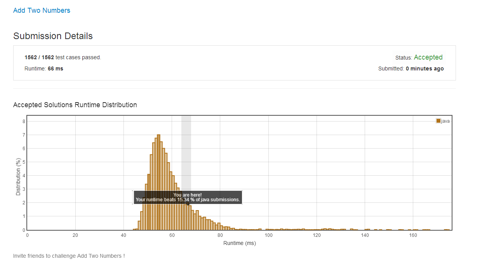

#Add Two Numbers
You are given two non-empty linked lists representing two non-negative integers. 
The digits are stored in reverse order and each of their nodes contain a single digit. Add the two numbers and return it as a linked list.
You may assume the two numbers do not contain any leading zero, except the number 0 itself.

Input: (2 -> 4 -> 3) + (5 -> 6 -> 4)
Output: 7 -> 0 -> 8

###解释
给了你两个非空并且不为负数的int类型链表，数字逆序存储，每个节点只包含一个数字。把这2个链表的数字相加，返回一个list链表结果
例如(2 -> 4 -> 3) + (5 -> 6 -> 4)  
2+5  4+6  3+7
返回：
7 ->  0 -> 8

###难度
中等

#第一遍结果
